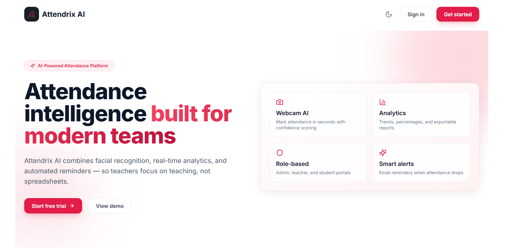
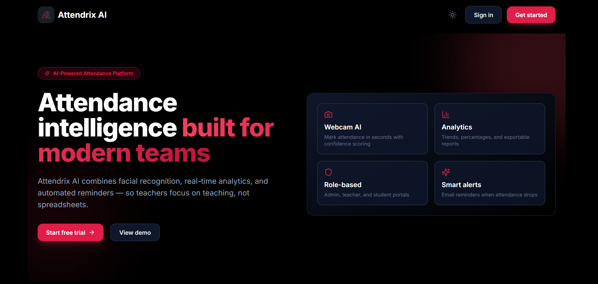

# 🎓 Attendrix AI

**Attendrix AI** is a state-of-the-art, AI-powered attendance management platform. It streamlines the attendance process for educational institutions by replacing manual roll calls with automated, secure, and frictionless identity verification using facial recognition, liveness detection, and geolocation.

### 🔗 [Live Demo → attendrix-ai.vercel.app](https://attendrix-ai.vercel.app/)

<p align="center">
  
  &nbsp;
  
</p>

---

## ✨ Key Highlights

- **🤖 AI Facial Recognition & Liveness Detection**: Integrates `face-api.js` directly in the browser to run high-speed facial landmark detection. Employs randomized liveness challenges (blink, smile, head turns) to prevent spoofing.
- **📍 Geofenced Attendance**: Verifies that students are physically present in the classroom using GPS location data before marking attendance.
- **🛡️ Secure Identity & RBAC**: Stateless, token-based authentication (JWT) with strict Role-Based Access Control (Admin, Faculty, Student) for accessing dashboards and API endpoints.
- **📊 Advanced Analytics Dashboards**: Role-specific dashboards built with React and Recharts. Administrators get a high-level view of departmental statistics, teachers track course-specific attendance trends, and students view their individual performance.
- **📧 Automated Notifications**: Built-in email service (Nodemailer) that alerts students via email when their attendance drops below the critical threshold (e.g., 75%).
- **📄 One-Click Export**: Comprehensive PDF and CSV attendance report generation for administrative auditing and offline records.
- **🚀 Scalable REST Architecture**: A high-performance Express.js backend with an optimized MongoDB database schema, ready to scale across thousands of concurrent student requests.

---

## 🛠️ Technology Stack

| Layer | Technologies |
|-------|--------------|
| **Frontend** | React 18, Tailwind CSS, Lucide React, Recharts, react-hot-toast, react-webcam |
| **Backend** | Node.js, Express.js (MVC Pattern), JWT, bcryptjs, Nodemailer, PDFKit |
| **Database** | MongoDB & Mongoose |
| **AI / ML** | `face-api.js` (Browser-based Face Detection & Facial Landmarks) |

---

## 🚀 Quick Start Guide

### Prerequisites
- Node.js (v18+)
- MongoDB (Local instance or MongoDB Atlas cluster)

### 1. Database Setup
Ensure MongoDB is running locally or copy your MongoDB Atlas URI into the backend environment variables.

### 2. Backend Initialization (Port 5000)
```bash
cd backend
cp .env.example .env  # Ensure MONGODB_URI is correctly set
npm install
npm run seed          # Seeds the database with demo users, courses, and departments
npm run dev           # Starts the development server using nodemon
```
*Health check: `http://localhost:5000/api/v1/health`*

### 3. Frontend Initialization (Port 3001)
```bash
# From the root directory
cp .env.example .env
npm install
npm start
```
*Access the app at: `http://localhost:3001`*

---

## 🔑 Demo Accounts (Available after `npm run seed`)

| Role | Email | Password |
|------|----------|----------|
| **Admin** | admin@attendrix.ai | admin123 |
| **Teacher** | teacher@attendrix.ai | teacher123 |
| **Student** | student@attendrix.ai | student123 |

---

## 🏗️ Project Architecture

```
Attendrix-AI/
├── src/                 # React Frontend application
│   ├── components/      # Reusable UI components (Layout, Dashboards, Webcam)
│   ├── pages/           # Route-specific pages
│   ├── services/        # Frontend API client logic
│   └── utils/           # Utility functions
├── backend/             # Node.js/Express REST API
│   ├── config/          # Environment variables and Database configuration
│   ├── controllers/     # API route handlers
│   ├── middleware/      # Authentication, RBAC, and Error handling
│   ├── models/          # Mongoose database schemas
│   ├── routes/          # API route definitions
│   ├── services/        # Business logic (Email, PDF generation)
│   └── scripts/         # Database seeding scripts
└── public/              # Static assets and AI model weight files
```

---

## 📡 API Endpoints Overview

| Method | Endpoint | Description |
|--------|----------|-------------|
| **POST** | `/api/v1/auth/login` | Authenticate user and issue JWT token |
| **POST** | `/api/v1/attendance/mark-live` | Verify live face embedding and mark attendance |
| **GET** | `/api/v1/analytics/dashboard` | Retrieve high-level statistics for Admin |
| **POST** | `/api/v1/attendance/remind` | Trigger low-attendance email notifications |
| **GET** | `/api/v1/export/:courseId/pdf` | Generate and download course attendance PDF |

---

## 👨‍💻 Author

**Arjun Vashishtha**

[](https://github.com/arjunvashishtha13)
[](https://www.linkedin.com/in/arjun-vashishtha13)

---

<p align="center">
  <b>Attendrix AI</b> — Revolutionizing classroom management with Artificial Intelligence.<br/>
  <a href="https://attendrix-ai.vercel.app/">🔗 Live Demo</a>
</p>
